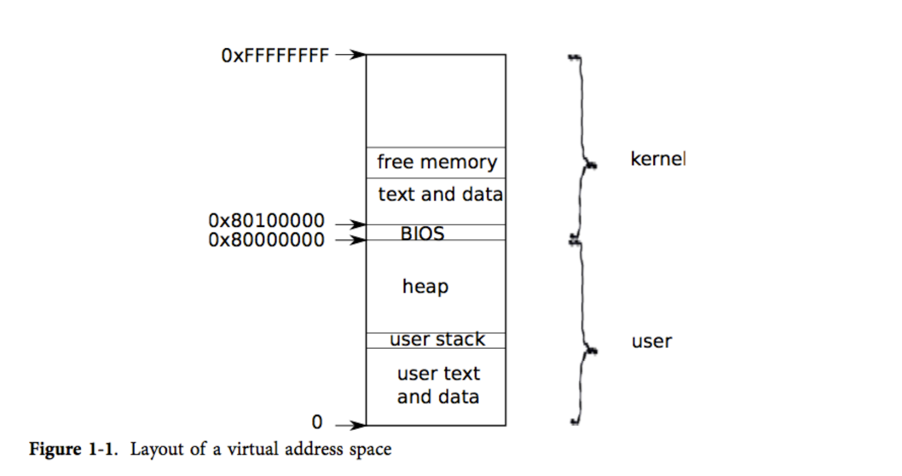
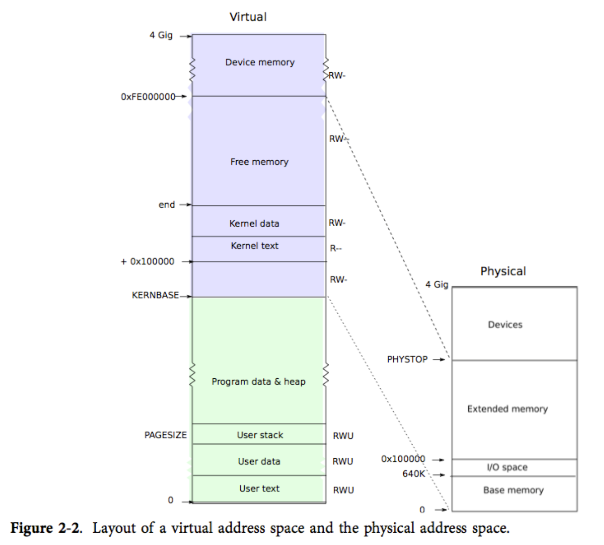
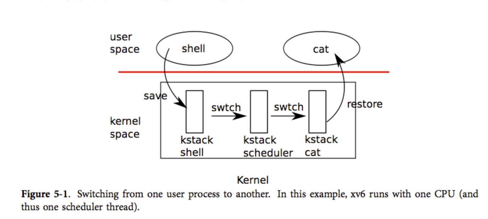

# DS-OS
An ordinary Operating System for ARM-CONTEX-A7,which imitate xv6(OS from MIT)

# 相关链接
[中文翻译](https://th0ar.gitbooks.io/xv6-chinese/content/)
[原项目](https://github.com/Xv64/OS.git)

# 内容
## 内存映射
- 手动实现第一进程的内容映射

## 二级页表
- 开启二级页表硬件选项，并在需要时将页表地址放入指定的寄存器

## 进程切换
- 开启中断，利用时钟中断，实现进行切换(包括保存和恢复寄存器，切换二级页表，切换进程描述符)

